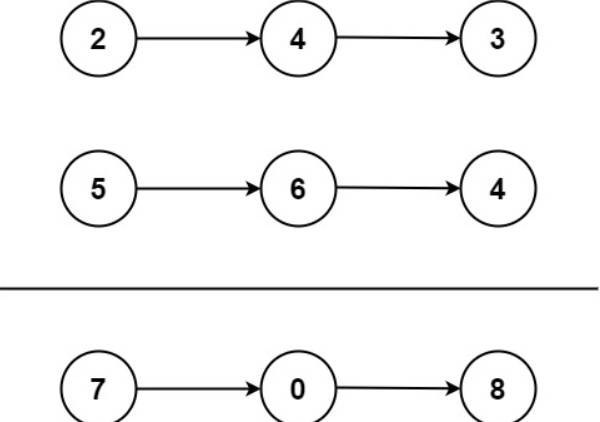

## 题目
给你两个 非空 的链表，表示两个非负的整数。它们每位数字都是按照 逆序 的方式存储的，并且每个节点只能存储 一位 数字。

请你将两个数相加，并以相同形式返回一个表示和的链表。

你可以假设除了数字 0 之外，这两个数都不会以 0 开头。

示例 1：

输入：l1 = [2,4,3], l2 = [5,6,4]
输出：[7,0,8]
解释：342 + 465 = 807.
示例 2：

输入：l1 = [0], l2 = [0]
输出：[0]
示例 3：

输入：l1 = [9,9,9,9,9,9,9], l2 = [9,9,9,9]
输出：[8,9,9,9,0,0,0,1]
提示：

每个链表中的节点数在范围 [1, 100] 内
0 <= Node.val <= 9
题目数据保证列表表示的数字不含前导零
Related Topics
递归
链表
数学

## 代码实现

### java

~~~java
class Solution {
    public ListNode addTwoNumbers(ListNode l1, ListNode l2) {
        int carry = 0, val = 0;
        ListNode result = null, top = null;
        while (l1 != null && l2 != null) {
            val = (l1.val + l2.val + carry) % 10;
            carry = (l1.val + l2.val + carry) / 10;
            if (result == null) {
                result = new ListNode(val);
                top = result;
            } else {
                ListNode next = new ListNode(val);
                result.next = next;
                result = next;
            }
            l1 = l1.next;
            l2 = l2.next;
        }

        while (l1 != null) {
            val = (l1.val + carry) % 10;
            carry = (l1.val + carry) / 10;
            ListNode node = new ListNode(val);
            result.next = node;
            result = node;
            l1 = l1.next;
        }
        while (l2 != null) {
            val = (l2.val + carry) % 10;
            carry = (l2.val + carry) / 10;
            ListNode node = new ListNode(val);
            result.next = node;
            result = node;
            l2 = l2.next;
        }
        if (carry > 0) {
            ListNode node = new ListNode(carry);
            result.next = node;
            result = node;
        }
        return top;
    }
}
~~~

